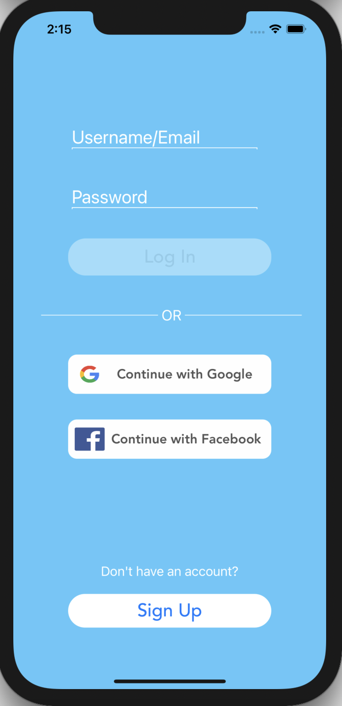
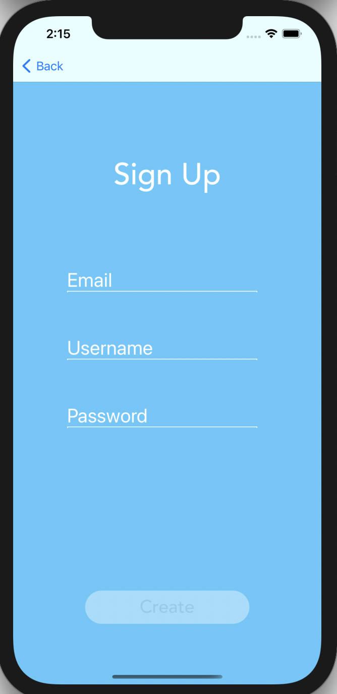
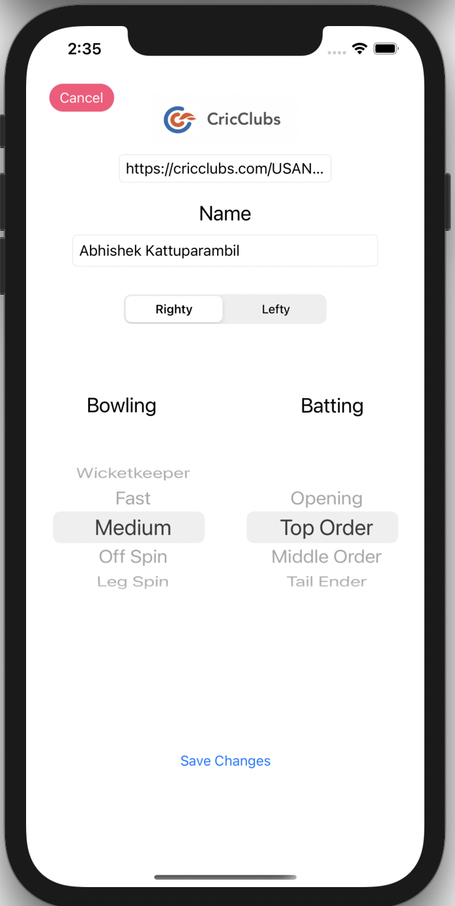
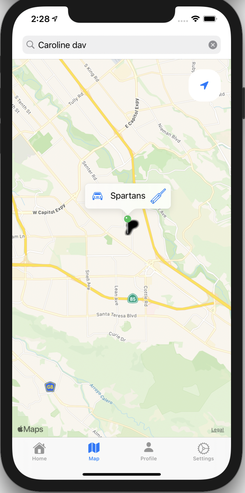
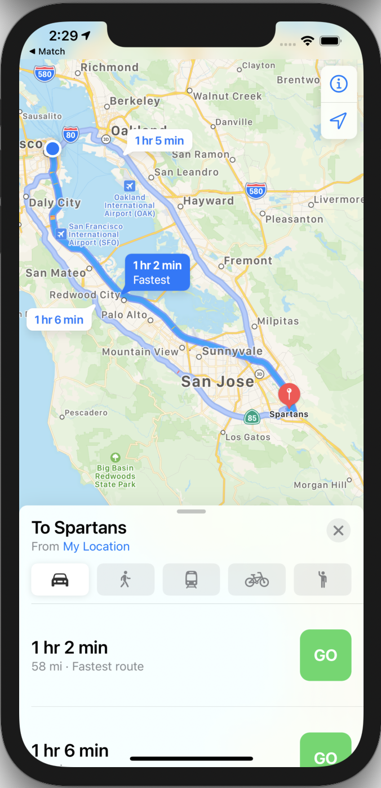

# Match

Match is designed to be somewhat of a social media platform for grassroots cricket in America. Cricket remains critically underfunded and resources are quite limited — there aren't enough quality fields and practice facilities to support the amount of players, especially in the Bay Area. Match aims to provide a sense of coherency between players by allowing teams and players to 'book' grounds while they are using them. This ensures that the entire system is moving as efficiently as possible, while also providing a platform for prospective players to look for teams and meet other players. In its final stages, I hope for Match to be able to provide the cricket community with all the resources they need to grow. 

| | | | | |
|:-------------------------:|:-------------------------:|:-------------------------:|:-------------------------:|:-------------------------:|
| | | | | |
|Sign In|Sign Up|Edit Profile|Map|Maps Integration|
